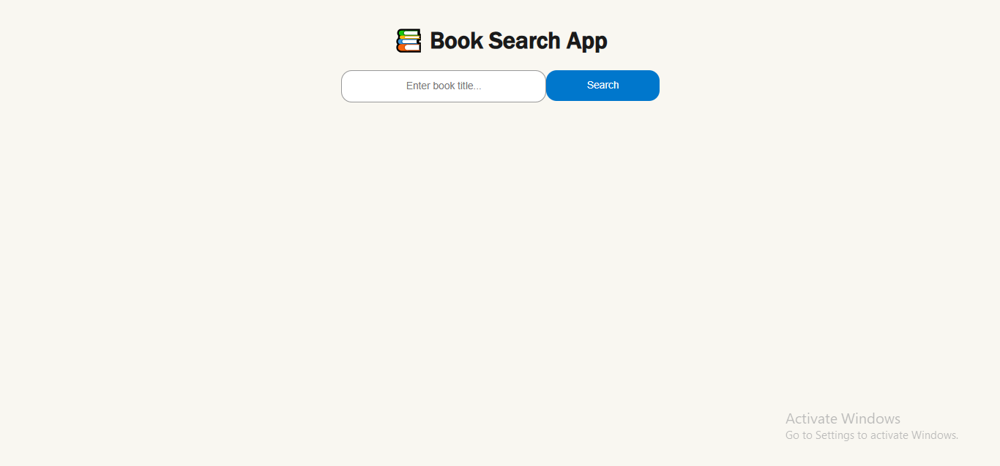
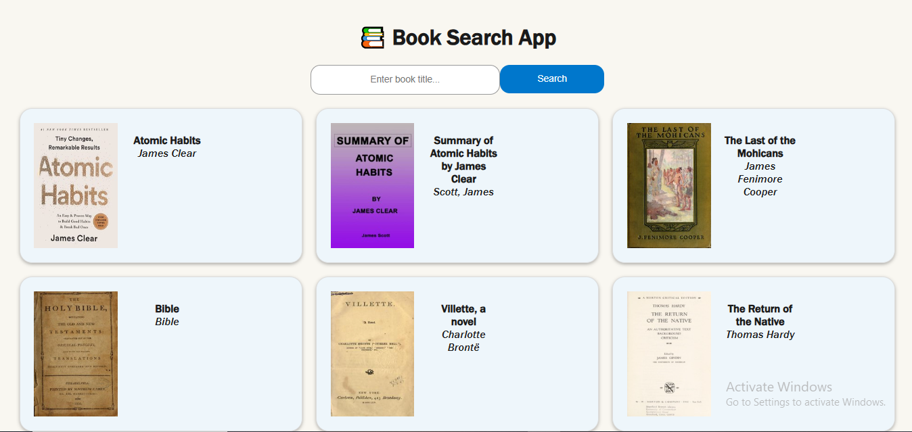

# 📚 Book Search App

Welcome to the **Book Search App** built using **React JS**!  
This app allows users to search for books by title and view information like cover image, title, and author — all in real time. 🎯

---

## 🖼️ Initial Look  

---

## 🔎 How It Works

1. Enter a **book title** in the input field  
2. Click on **Search**  
3. The app fetches book results from Open Library API  
4. Shows:
   - 📘 Book Cover
   - ✍️ Author Name(s)
   - 🏷️ Title

---

## ⚙️ Tech Stack

- ⚛️ React JS (useState, useEffect)
- 📡 Fetch API
- 🧠 Open Library API (No API key needed)

---

## 🚀 Features

- 🔍 Real-time book search by title  
- 📚 Display of top 20 matching results  
- 🖼️ Book covers shown using Open Library cover API  
- ❌ If no book is found, shows message  
- 🧠 Handles loading and errors gracefully

---

## 🖼️ Final UI Screenshot

---

## 🧪 API Used

- **Open Library Search API:**  
  `https://openlibrary.org/search.json?q=your_query`

- **Cover Images:**  
  `https://covers.openlibrary.org/b/id/{cover_i}-M.jpg`

> ✅ No API key required — completely free & open

---

## 📂 Project Structure (Basic)
📁 src 
┣ 📄 App.jsx 
┣ 📄 index.js 
┗ 📄 styles.css  

---

## 🤝 Let's Connect

Made with ❤️ by **Majid Ali**  
🌐 GitHub: [Majidali90121](https://github.com/Majidali90121)

---

